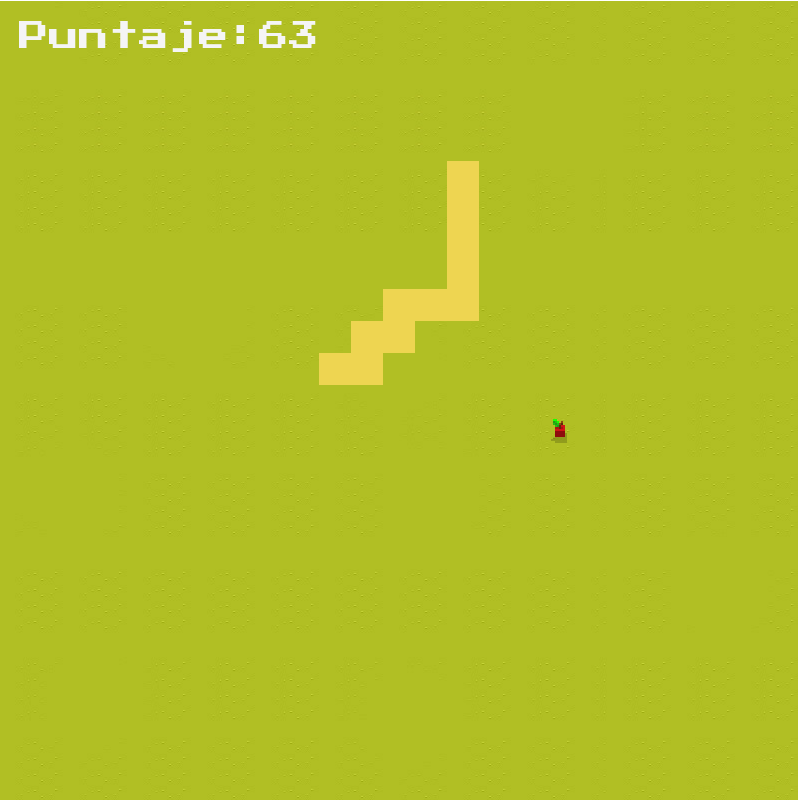
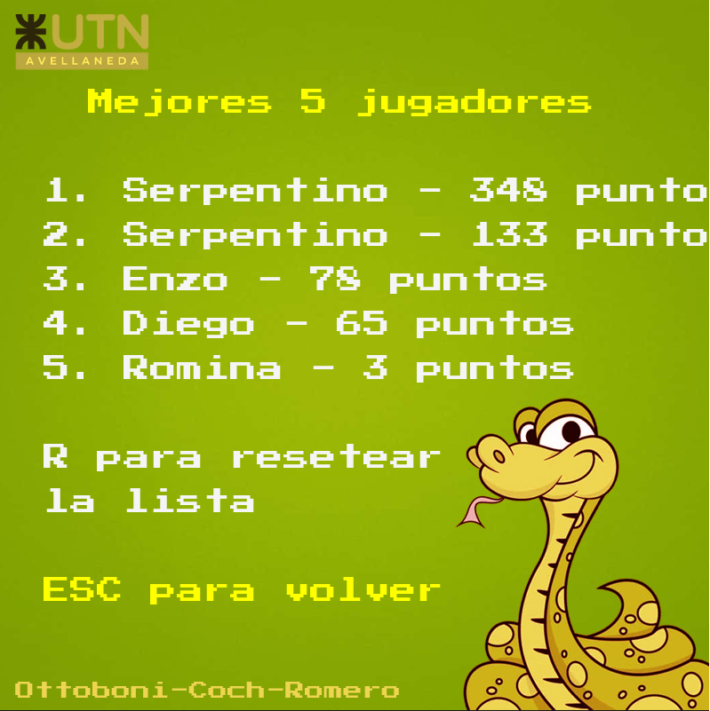

# 🐍 El Juego De La Serpiente

## Descripción
**El Juego De La Serpiente** es es un remake del clásico juego **Snake**, desarrollado en **Python** utilizando la biblioteca **Pygame**. Controla una serpiente que crece al comer manzanas, pero ten cuidado de no chocar contigo mismo o con los bordes del mapa. Este proyecto es una excelente introducción a la creación de videojuegos y a la programación con *PyGame*.

## Capturas de pantalla 📷

|  |  |
| ---- | ---- |
|  |  |

## Características
- **Jugabilidad clásica**: La serpiente se mueve en una cuadrícula y crece al comer una manzana.
- **Música de fondo**: Se reproduce continuamente durante el juego.
- **Efectos de sonido**: Sonidos para eventos clave, como comer o perder.
- **Puntuación**: Se muestra la puntuación del jugador en pantalla.

## Funcionalidades ⚙️
- **Controles sencillos**: Movimiento con teclas de flecha o `WASD`
- **Sonidos y música**: Música de fondo que hacen el juego más entretenido.

## Instalación 💻

### Requisitos previos
Para ejecutar este juego necesitas tener instalados:
- Python 3.8 o superior
- PyGame 2.0 o superior

### Paso a paso
1. Clona el repositorio:
    ```bash
    git clone https://github.com/ottoboni11/snake-game.git
    cd snake-game
    ```
2. Ejecuta el juego:
    ```bash
    python main.py
    ```

## Controles 🎮
- **Movimiento**: Flechas de dirección o `WASD`.

## Contribuir 💪
Si deseas contribuir al proyecto, sigue estos pasos:
1. Haz un fork del repositorio.
2. Crea una nueva rama (`git checkout -b feature-nueva-funcionalidad`).
3. Realiza tus cambios y haz un commit (`git commit -m 'Agrega nueva funcionalidad'`).
4. Sube los cambios a tu rama (`git push origin feature-nueva-funcionalidad`).
5. Abre un Pull Request.

## Equipo 🤝
Equipo de Desarrollo: **Unnamed**

### Integrantes 🤓

- **Lautaro Ottoboni** –
  [GitHub](https://github.com/ottoboni11) 

- **Santino Coch** – 
  [GitHub](https://github.com/SantiCoch) 

- **Tomás Romero** – 
  [GitHub](https://github.com/tomasrome) 

¡Gracias por jugar y apoyar nuestro juego!

## Créditos 📜
Este juego fue desarrolado utilizando la librería [PyGame](https://www.pygame.org/). Agradecimienos especiales a las fuentes de recursos gráficos y de audio disponibles de manera grautita.

<p align="center">  </p>
